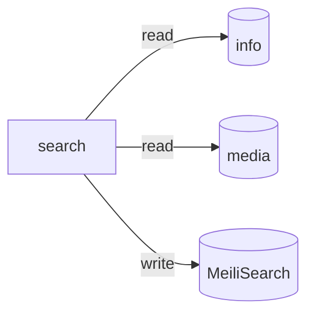

# search



Meilisearch is exposed on a separate domain: https://search.alsosee.info/ and used by [finder](https://github.com/alsosee/finder).

## Local developmenth

Checkout [info](https://github.com/alsosee/info) and [media](https://github.com/alsosee/media) directories in the same directory as this repo:

```shell
tree .
├── info
├── media
└── search
```

Run MeiliSearch:

```shell
docker compose up search -d
```

Create index:

```shell
curl -X "POST" "http://127.0.0.1:7700/indexes" \
     -H 'Authorization: Bearer secret' \
     -H 'Content-Type: application/json' \
     -d $'{
  "uid": "info",
  "primaryKey": "ID"
}'
```

Run the app:

```shell
docker compose up indexer
```
